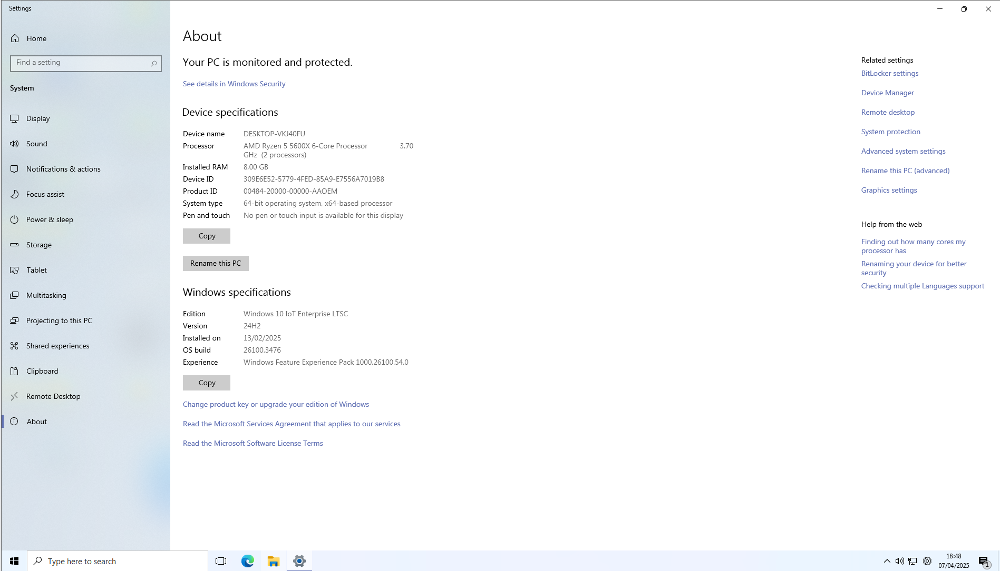

# Windows 10 Settings App on Windows 11 Version 24H2

This is a small project meant to fix some of the broken functionality/pages in the Windows 10 Settings app on Windows 11 Version 24H2.

> [!WARNING]
> **THIS PROJECT IS IN EARLY DEVELOPMENT**
>
> You may encounter issues, unfinished stuff, glitches, the works. This modification is released with no warranty.
>
>
> **Knowing this, You might use this at your own risk.**
>

